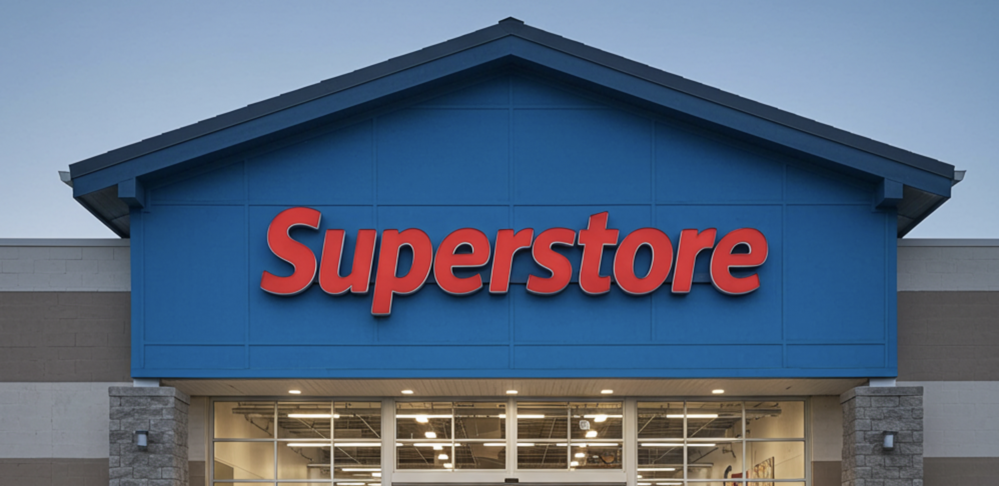

# 🛒 Superstore Analytics Dashboard 

A comprehensive retail analytics project developed for **Hackathon 3** by Kelompok 1 (Chris & Yora), focused on uncovering sales insights and customer behavior from Superstore's transaction data (2014–2017).

## 📊 Project Overview

Superstore is a leading U.S. retail chain offering consumer products in **Furniture**, **Office Supplies**, and **Technology** categories. This project analyzes over 4,000 transactions to help executive stakeholders understand sales trends, customer retention, and profitability drivers.

We developed an **interactive Looker Studio dashboard** and conducted in-depth analysis using Python (Jupyter Notebook), producing actionable insights to guide business strategy.

## 💡 Business Goals

1. **Increase sales** in underperforming categories and sub-categories.
2. **Optimize discount strategies** to maximize profit.
3. **Enhance segmentation-based marketing** to balance sales distribution.
4. **Analyze sales trends** over time.
5. **Improve customer retention** through cohort analysis.

## 🧠 Key Insights

* 📉 Sales decline spotted in several product segments.
* 💸 Higher discounts often lead to **lower profits**, emphasizing smarter discounting strategies.
* 🧍‍♂️ **Home Office** customers dominate (51.7%), followed by Corporate and Consumer segments.
* 📅 Retention drops sharply after the first month, suggesting a need for **loyalty programs**.
* 📍 Certain states and regions outperform others, indicating expansion opportunities.

## 📈 Dashboard Features

The dashboard includes:

* **Sales & Profit Over Time**
* **Top Customers & Segments**
* **Customer Cohort Analysis**
* **Product Category Breakdown**
* **Sales by State**
* **Discount vs Profit Analysis**

> 📎 See the full interactive dashboard and visualizations in the Looker Studio export.

## 🛠️ Tools & Technologies

* **Python** (Pandas, Seaborn, Matplotlib)
* **Google Looker Studio** (Dashboarding)
* **Jupyter Notebook** (Exploratory Data Analysis)
* **PDF Reports & Presentations**

## 📁 Repository Structure

```
📦 Superstore-Analytics
├── input                   # Input folder
    ├── sample.csv          # Superstore dataset
├── output                  # Output folder
    ├── cohort.csv          # cohort csv
    ├── data.csv            # cleaned superstore dataset
    ├── plot                # Plot folder
        ├── scatter.csv     # scatter csv
├── hackaton_3.ipynb        # Python analysis notebook
├── LookerDashboard.pdf     # Exported dashboard visual
├── Presentation.pdf        # Summary slides
├── README.md               # This file
```

## 🤝 Contributors

* Christian ([@Christian-Chrata](https://github.com/Christian-Chrata))
* Yora Okta Aviani Rahardjo([@yoraokta](https://github.com/yoraoktaar))